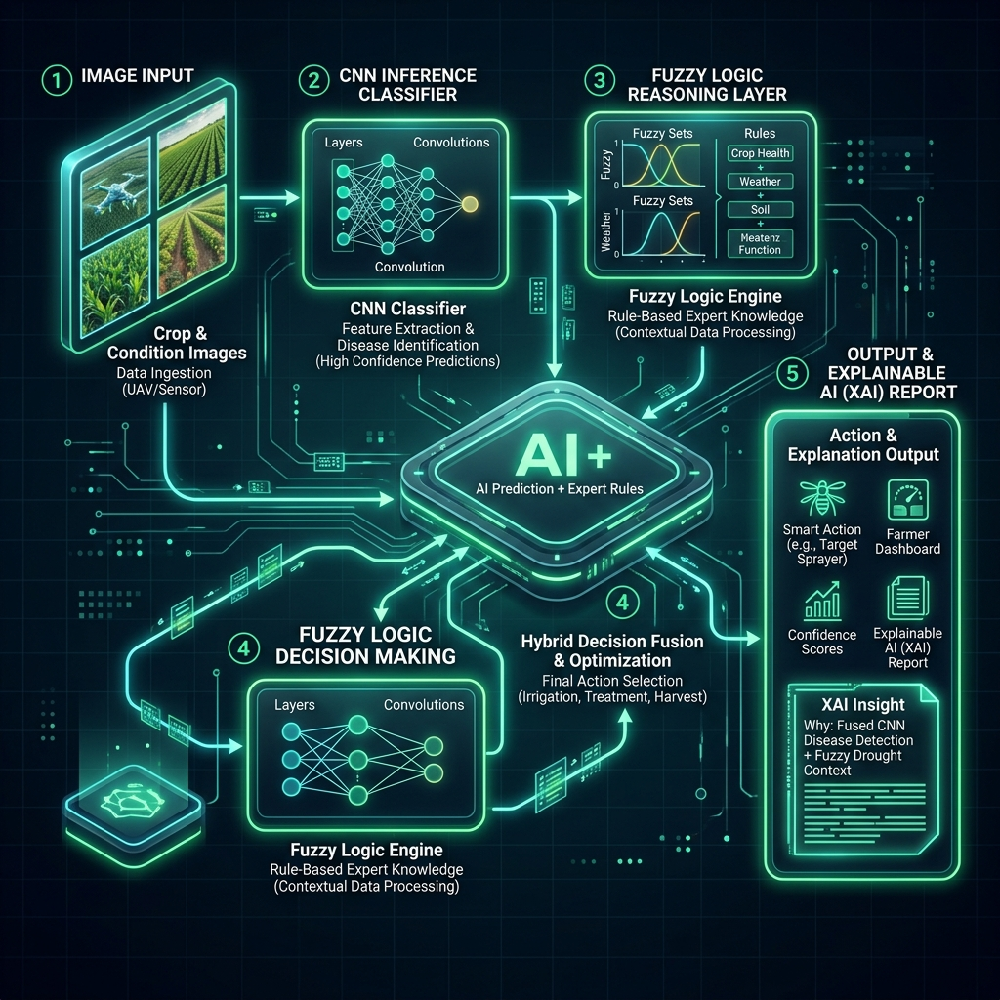

Tên đề tài: An Explainable Intelligent System for Plant Disease Severity Assessment using Fuzzy Inference

* Áp dụng trên Intelligent Rice Diagnostic Control Centre (Hệ thống Thông minh Chẩn đoán Bệnh Lúa)

**Báo cáo Môn học Hệ thống Thông minh - Nhóm 14**

Hệ thống cung cấp giải pháp phân tích hình ảnh AI (CNN) kết hợp cùng hệ chuyên gia (Fuzzy Logic) nhằm chẩn đoán mức độ bệnh của cây lúa và đưa ra các giải thích trực quan (Explainable AI - XAI), kèm theo các khuyến nghị nông nghiệp thiết thực.

---

## 🌟 Tổng quan Kiến trúc (Hybrid Pipeline)

Hệ thống hoạt động theo quy trình Hybrid (lai) với 5 bước chính:



1. **[INPUT]** Tiếp nhận hình ảnh lá lúa và thông tin môi trường (nhiệt độ, độ ẩm).
2. **[CNN Inference]** Trích xuất triệu chứng hình ảnh qua mạng nơ-ron tích chập (EfficientNet-B0), xuất ra xác suất (softmax scores) cho 9 lớp trạng thái.
3. **[Fuzzy Reasoning]** Đưa kết quả CNN và thông tin môi trường vào bộ suy diễn mờ Sugeno.
4. **[Hybrid Decision]** Kết hợp các luật mờ IF-THEN của chuyên gia nông nghiệp với kết quả Deep Learning.
5. **[Output + XAI]** Đưa ra cảnh báo cuối cùng và báo cáo giải thích ngôn ngữ tự nhiên.

---

## 📂 Cấu trúc Dự án

```
project/
├── app_streamlit.py               ← Ứng dụng điều khiển chính (Web Dashboard)
├── rice/                          ← Module học sâu CNN (Computer Vision)
│   ├── train_cnn.py               ← Script huấn luyện mô hình
│   └── inference_cnn.py           ← Script suy diễn mô hình
├── rice_fuzzy_xai/                ← Module suy diễn mờ & XAI (Logic Core)
│   ├── engine.py                  ← Bộ động cơ mờ (Fuzzy Engine)
│   ├── explanation.py             ← Trình tạo báo cáo giải thích (XAI)
│   ├── membership.py              ← Các hàm thuộc (Membership functions)
│   └── rules.py                   ← Cơ sở tri thức (Luật mờ chuyên gia)
├── rice_disease_cnn_outputs/      ← Kết quả từ quá trình huấn luyện AI
│   └── best_model.pt              ← Trọng số mạng CNN tốt nhất
├── docs/                          ← Tài liệu báo cáo và hình ảnh
│   ├── Pipeline.jpg               ← Sơ đồ luồng hoạt động
│   └── HTTT-Nhóm 14 -REPORT.docx  ← Báo cáo chi tiết
└── demo_assets/                   ← Dữ liệu hình ảnh mẫu cho quá trình thử nghiệm
```

---

## 🚀 Hướng dẫn Cài đặt & Khởi chạy

1. **Tạo môi trường ảo (Virtual Environment):**
   ```bash
   python -m venv venv
   ```

2. **Kích hoạt môi trường (Windows):**
   ```bash
   .\venv\Scripts\activate
   ```

3. **Cài đặt thư viện:**
   ```bash
   pip install -r rice/requirements.txt
   pip install streamlit fastapi uvicorn python-multipart
   ```

4. **Khởi động Backend API (CNN OOD Detection):**
   ```bash
   uvicorn rice_api_backend.api:app --host 0.0.0.0 --port 8000
   ```

5. **Khởi động Dashboard (Streamlit Frontend):**
   Mở một Terminal mới, kích hoạt venv và chạy:
   ```bash
   streamlit run app_streamlit.py
   ```
   *Trình duyệt sẽ tự động mở tại `http://localhost:8501`*

---

## 🔬 Tính năng Nổi bật

- **Nhận diện tự động:** Phân loại 4 nhóm bệnh chính trên lúa (Đạo ôn, Bạc lá, Đốm nâu, Tungro) và trạng thái khỏe mạnh.
- **Xử lý bất định sinh học:** Logic mờ (Fuzzy Logic) giúp xử lý được tính thiếu chắc chắn của đặc trưng hình ảnh và sự phức tạp của thời tiết.
- **Explainable AI (AI có thể giải thích):** Trình bày lý do đằng sau mỗi quyết định chẩn đoán bằng cách hiển thị các luật mờ (Fuzzy Rules) đã được kích hoạt cùng mức trọng số.
- **Khuyến nghị tự động:** Hệ thống tự động đề xuất các biện pháp canh tác và thuốc bảo vệ thực vật tương ứng với mức độ báo động (Normal, Attention, Danger, Red Alert).

---

## ⚙️ Bảng Đóng góp Hệ thống (System Contribution Table)

The proposed architecture is designed as a hybrid intelligent decision-support system rather than a standalone image classifier.

| Component | Contribution |
| :--- | :--- |
| **CNN (EfficientNet-B0)** | Visual disease perception and feature extraction |
| **Fuzzy Inference System** | Severity reasoning and continuous interpolation |
| **Environmental Risk Index (ERI)** | Contextual alert escalation |
| **OOD Detection & Entropy** | Uncertainty handling and anomaly detection |
| **Explainability Layer (XAI)** | Rule traceability and interpretable reasoning |
| **Expert Fusion** | Human-guided field adjustment |

---

## 📊 Official Evaluation Metrics

All quantitative results reported in this work are based on the final evaluation protocol using 180 labeled validation images from the Severity-based Rice Leaf Diseases Dataset.

*   **Fuzzy Severity Accuracy:** 98.33% (177/180)
*   **Macro F1-score (Severity):** 98.75%
*   **Disease-level Consistency:** 100.00%
*   **CNN Backbone:** EfficientNet-B0 (Tối ưu hóa bằng Label Smoothing 0.1 để tránh cứng hóa phổ điểm Softmax, hỗ trợ tốt nhất cho tầng Fuzzy Inference).

> **Lưu ý**: Dữ liệu train và validation có thể tìm thấy tại [Severity-Based Rice Leaf Diseases (Kaggle)](https://www.kaggle.com/datasets/isaacritharson/severity-based-rice-leaf-diseases-dataset).

---
*Developed by Group 14 - Hệ thống Thông minh*