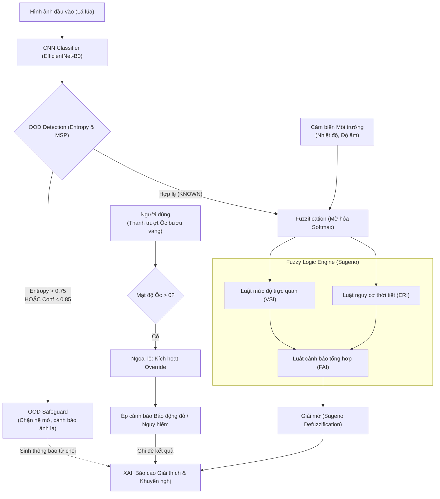

# TƯ DUY KIẾN TRÚC HỆ CHUYÊN GIA MỜ (FUZZY LOGIC) TRONG DỰ ÁN

Đây là tài liệu đúc kết tư duy đằng sau việc áp dụng Logic Mờ (Fuzzy Logic) vào hệ thống chẩn đoán bệnh lúa. Nội dung này là "điểm sáng" (highlight) cực kỳ quan trọng để bảo vệ đồ án, chứng minh hệ thống không chỉ là một mô hình AI nhận diện ảnh thông thường, mà là một **Hệ thống Hỗ trợ Ra quyết định (DSS - Decision Support System)** có tri thức.

---

## 1. Triết lý Thiết kế: Tại sao lại cần Fuzzy Logic?
Mạng nơ-ron chập (CNN) rất giỏi trong việc "Nhìn" (Perception) - phân biệt vết bệnh trên lá. Tuy nhiên, nó không biết suy luận (Reasoning). Trong nông nghiệp, một vết bệnh nhỏ (Đạo ôn nhẹ) nhưng xuất hiện trong thời tiết **Lạnh và Ẩm** có thể bùng phát thành dịch lớn chỉ sau 1 đêm. Ngược lại, vết bệnh lớn nhưng thời tiết **Nắng và Khô ráo** thì lây lan rất chậm.

$\rightarrow$ **Tư duy cốt lõi:** Kết hợp khả năng "Nhìn" của CNN với khả năng "Suy luận ngữ cảnh" của Hệ Chuyên Gia Mờ (sử dụng luật Sugeno) để bắt chước tư duy của một kỹ sư Nông nghiệp lão luyện.

---

## 2. Tư duy xử lý trong điều kiện BÌNH THƯỜNG (Normal Operations)
Khi hình ảnh là hợp lệ (thuộc 4 loại bệnh đã học), hệ thống vận hành theo chuỗi tư duy 3 bước:

### Bước 1: Mờ hóa đầu vào (Fuzzification)
*   **Từ CNN:** Điểm xác suất Softmax không được dùng trực tiếp như một con số cứng nhắc. Nó được "mờ hóa" thành các tập hợp `Low`, `Medium`, `High` đại diện cho Mức độ bệnh (Mild/Severe).
*   **Từ Môi trường:** Nhiệt độ và Độ ẩm được chuyển thành các tập mờ (ví dụ: Độ ẩm 85% $\rightarrow$ Tập `Wet` (Ẩm ướt), Nhiệt độ 28°C $\rightarrow$ Tập `Warm` (Ấm)).

### Bước 2: Kích hoạt Luật Chuyên gia (Fuzzy Rules Execution)
Hệ thống tính toán song song hai hệ quả:
1.  **Chỉ số Nghiêm trọng Trực quan (VSI - Visual Severity Index):** Đánh giá mức độ tổn thương trên mặt lá thuần túy thông qua độ tự tin của CNN.
2.  **Chỉ số Nguy cơ Môi trường (ERI - Environmental Risk Index):** Đánh giá mức độ thuận lợi của thời tiết cho nấm/vi khuẩn phát triển. (Ví dụ: Nhiệt độ Ấm + Độ ẩm Ướt $\rightarrow$ Nguy cơ môi trường Rất Cao).

### Bước 3: Tổng hợp Quyết định (Sugeno Defuzzification)
*   Sử dụng luật Sugeno để lai ghép VSI và ERI thành **Mức độ Cảnh báo Cuối cùng (Final Alert Level - FAI)**.
*   *Luật tư duy (Ví dụ):* `NẾU [Nghiêm trọng = Nhẹ] VÀ [Nguy cơ Môi trường = Rất cao] THÌ [Cảnh báo = Danger (Nguy hiểm)]`. 
*   **Giá trị mang lại:** AI có thể cảnh báo "Nguy hiểm" ngay cả khi vết bệnh trên lá mới chỉ ở mức "Nhẹ". Đây là tính năng dự báo phòng ngừa mà một mô hình CNN đơn thuần không bao giờ làm được!

---

## 3. Tư duy xử lý trong điều kiện BẤT THƯỜNG (OOD / Exceptions)
Đây là phần tinh túy nhất của hệ thống, chứng minh hệ thống đạt chuẩn "Safe AI" (Trí tuệ nhân tạo an toàn). Có hai kịch bản bất thường được xử lý:

### Kịch bản 3A: Phòng vệ thụ động (OOD Safeguard)
*   **Vấn đề:** Khi người dùng tải lên ảnh không phải bệnh lúa (trứng ốc, chó mèo, bàn tay), CNN do giới hạn kiến trúc kín (Closed-set) sẽ tự động gán nhãn bừa bãi (Ví dụ: Trứng ốc $\rightarrow$ Tungro nặng).
*   **Tư duy giải quyết:** Dịch vụ API Backend đóng vai trò "người gác cổng", sử dụng **Shannon Entropy** và **Confidence Threshold** để phát hiện sự bối rối của mô hình.
*   **Phản ứng của Hệ mờ:** Khi API trả về cờ `is_ood = True`, Hệ Mờ lập tức **ĐÓNG CỬA (Tạm ngưng)**. Nó từ chối tính toán quy tắc mờ dựa trên dữ liệu "rác" từ CNN (nguyên tắc *Garbage In - Garbage Out*). Hệ thống thà báo "Chưa xác định" chứ tuyệt đối không khuyên nông dân đi mua thuốc trừ bệnh sai.

### Kịch bản 3B: Ghi đè Chủ động (Expert Exception Override)
*   **Vấn đề:** Trứng ốc bươu vàng là OOD với CNN, nhưng thực tế nó là dịch hại vô cùng phổ biến tại Việt Nam cần phải cảnh báo ngay. Đào tạo lại CNN thì tốn thời gian và chi phí.
*   **Tư duy giải quyết:** Chấp nhận một biến ngoại lệ thủ công (Thanh trượt "Mật độ ốc bươu vàng"). Khi người nông dân nhìn thấy ốc/trứng ốc và kéo thanh trượt này lên `> 0`:
    1.  Hệ mờ **lập tức tỉnh giấc**, ghi đè toàn bộ kết quả OOD/CNN.
    2.  Luật mờ chuyên biệt cho ốc bươu vàng được kích hoạt. Nếu mật độ > 3 con/m², hệ mờ trực tiếp phát lệnh **Báo động Đỏ (Red Alert)** bỏ qua mọi yếu tố thời tiết.
    3.  Khuyến nghị XAI được tiêm (inject) các lời khuyên hóa học đặc trị như Metaldehyde hoặc bắt thủ công.

---

## 4. TỔNG KẾT BÀI BẢO VỆ
*   *"Hệ thống của chúng em được thiết kế theo tư duy: Mắt nhìn (CNN) - Não phân tích (Fuzzy) - Khả năng nhận thức giới hạn (OOD) - Tôn trọng chuyên gia con người (Exception). Việc tích hợp OOD Detection và Expert Exception chứng minh hệ thống hoàn toàn có thể ứng dụng vào thế giới thực đầy rẫy nhiễu loạn mà không gây rủi ro kinh tế cho người nông dân."*

---

## 5. MINH HỌA THUẬT TOÁN (SƠ ĐỒ & TẬP LUẬT IF-THEN)

Để hội đồng dễ hình dung luồng chạy thực tế dưới background, dưới đây là sơ đồ kiến trúc Hybrid kèm theo trích xuất bộ luật IF-THEN đang chạy trong hệ thống.

### 5.1. Sơ đồ Khối Kiến trúc (Flowchart)



### 5.2. Tập luật IF-THEN cốt lõi (Pseudo-code)

Hệ thống kết hợp các luật Logic nhị phân (phòng vệ) và Logic mờ (suy diễn) như sau:

**[1. LUẬT PHÒNG VỆ OOD - OOD Safeguard]**
```text
IF (Shannon_Entropy > 0.75) OR (Max_Confidence < 0.85) THEN:
    - Trạng thái = "Out-of-Distribution"
    - Hành động = "Tạm ngưng Hệ chuyên gia Mờ, từ chối đưa ra lời khuyên dùng thuốc"
```

**[2. LUẬT MỜ MỨC ĐỘ BỆNH TRỰC QUAN - VSI]** *(Ví dụ trích xuất)*
```text
IF (Độ tự tin CNN bệnh Nặng là CAO) THEN Mức độ = "Nghiêm trọng" (Trọng số 90%)
IF (Độ tự tin CNN bệnh Nhẹ là CAO) THEN Mức độ = "Trung bình" (Trọng số 55%)
```

**[3. LUẬT MỜ NGUY CƠ THỜI TIẾT - ERI]** *(Ví dụ trích xuất)*
```text
IF (Nhiệt độ là ẤM) AND (Độ ẩm là ƯỚT) THEN Nguy cơ = "Cao" (Trọng số 85%)
IF (Nhiệt độ là NÓNG) AND (Độ ẩm là KHÔ) THEN Nguy cơ = "Thấp" (Trọng số 20%)
```

**[4. LUẬT MỜ CẢNH BÁO TỔNG HỢP - FAI]** *(Ví dụ trích xuất)*
```text
IF (Mức độ trực quan = Nghiêm trọng) AND (Nguy cơ thời tiết = Cao) THEN Cảnh báo = "Báo động Đỏ (Red Alert)"
IF (Mức độ trực quan = Trung bình) AND (Nguy cơ thời tiết = Thấp) THEN Cảnh báo = "Bình thường (Normal)"
```

**[5. LUẬT NGOẠI LỆ CHUYÊN GIA - Expert Exception]**
```text
IF (Mật độ ốc bươu vàng > 3 con/m²):
    THEN Bỏ qua kết quả CNN và OOD
    THEN Trạng thái = "Ốc bươu vàng"
    THEN Cảnh báo = "Báo động Đỏ (Red Alert)"
    THEN Khuyên dùng thuốc diệt ốc đặc trị (Metaldehyde/Niclosamide)

ELSE IF (0 < Mật độ ốc bươu vàng <= 3):
    THEN Bỏ qua kết quả CNN và OOD
    THEN Trạng thái = "Ốc bươu vàng"
    THEN Cảnh báo = "Chú ý (Attention)"
    THEN Khuyên bắt ốc thủ công, cắm cọc dụ đẻ trứng
```
